## Password Generator(JavaScript)

## create an application that enable to generate random passwords based on criteria that users' selected. So users can a strong password based on their choices that provides greater security.
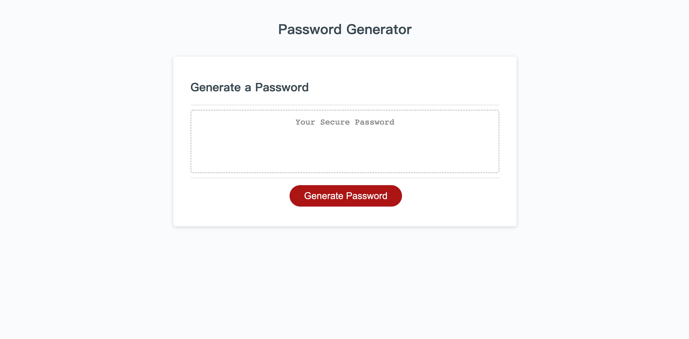

* click the button to generate a password, it presents with a series of prompts for password criteria
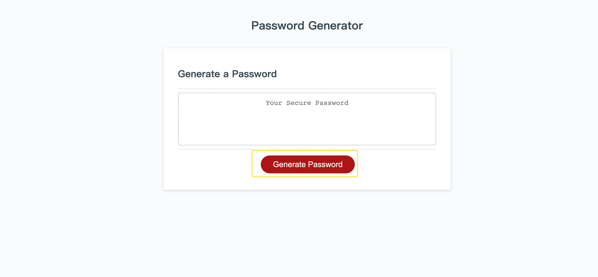
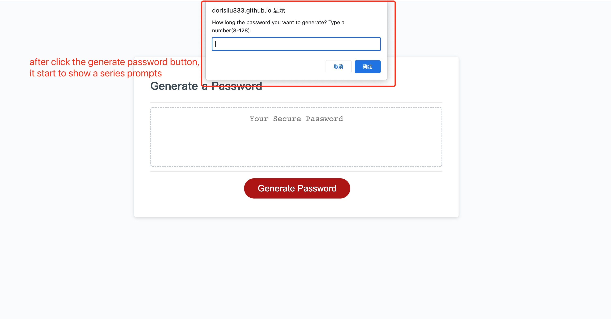

* choose a length of at least 8 characters and no more than 128 characters
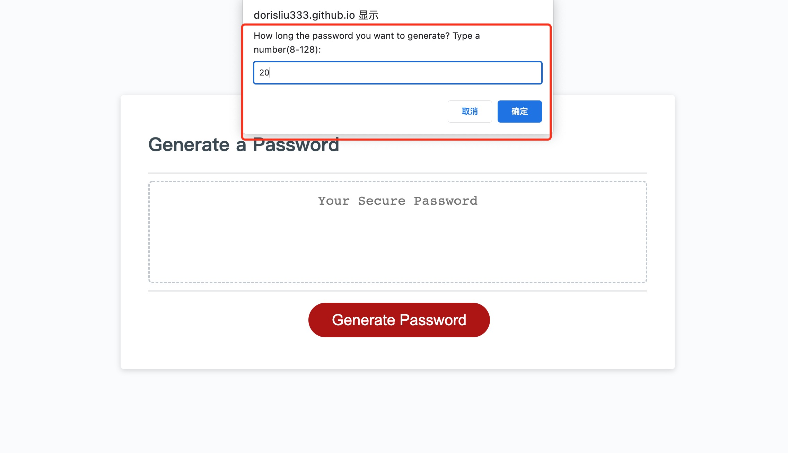

* if user's input is not number type or smaller than 8 or greater than 128, it will not accept,
will keep reminding and prompt to user until they input the valid number.
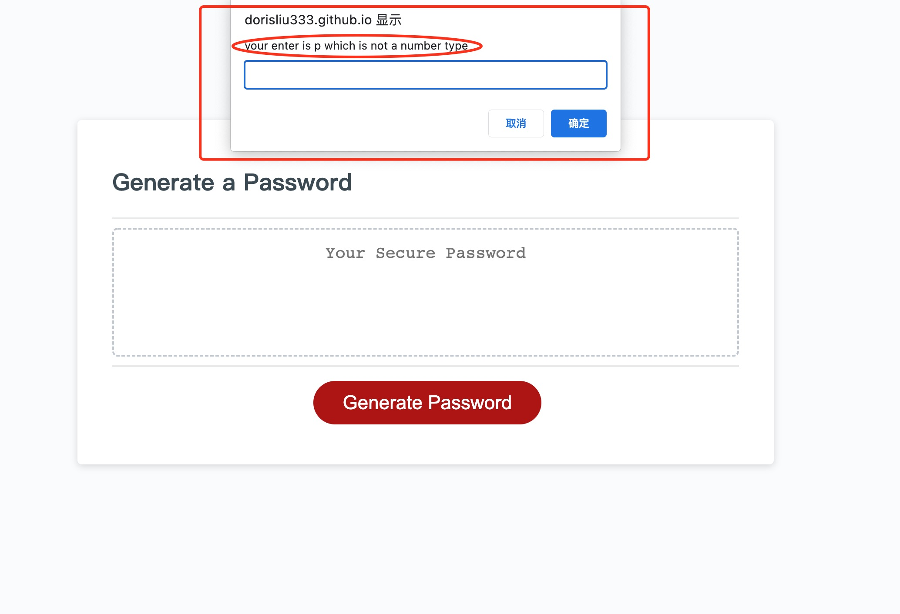
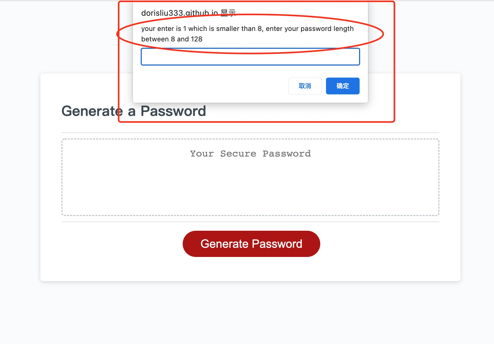
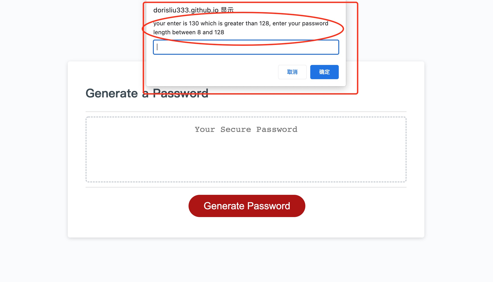

* after receive the valid number, it prompts each for selection lowercase, uppercase, numeric, and/or special characters
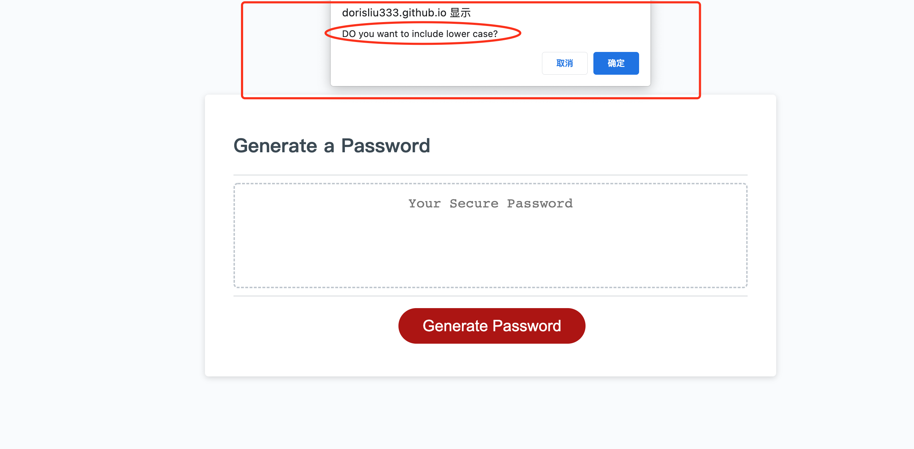
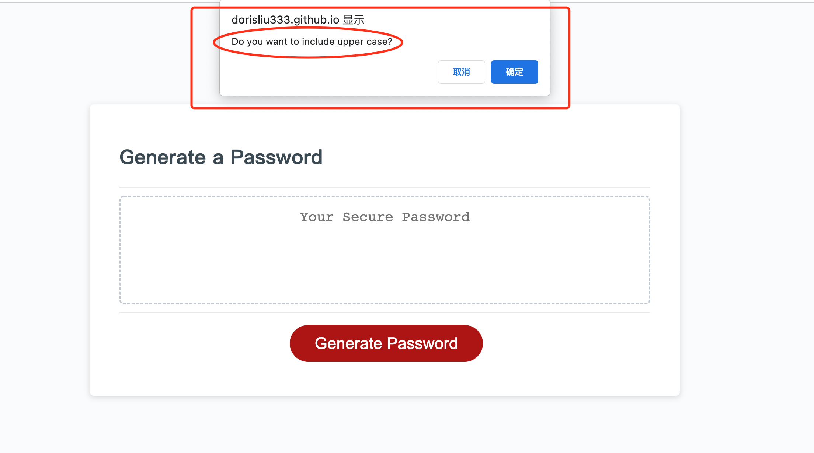
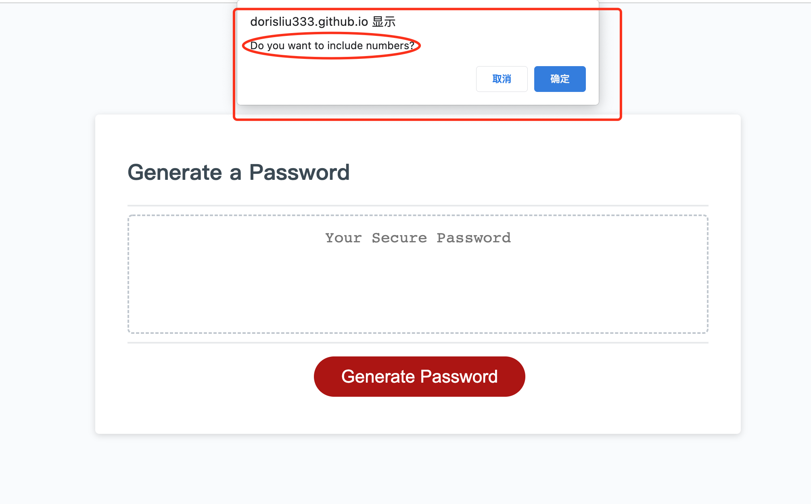
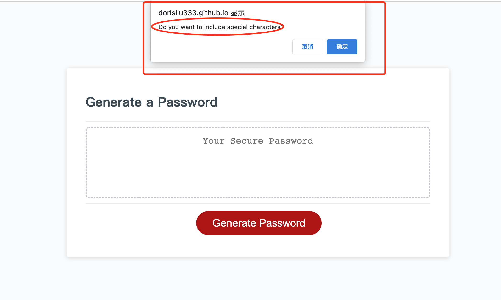

* if user doesn't chose any selection, it will alert at least one character type should be selected
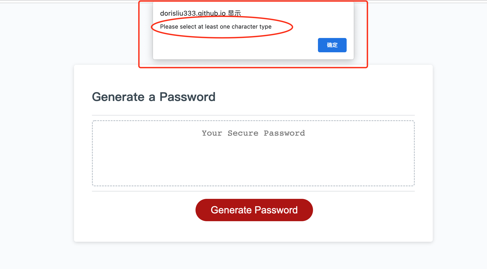 

* once input should be validated and all prompts are answered, it will generate a password that matches the selected criteria, display in the text area
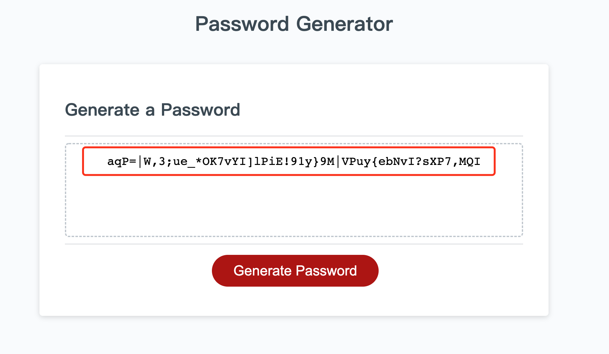 

## example:
* if I wanna generate a 50 length password which includes number and special characters, it will generate a password as show:
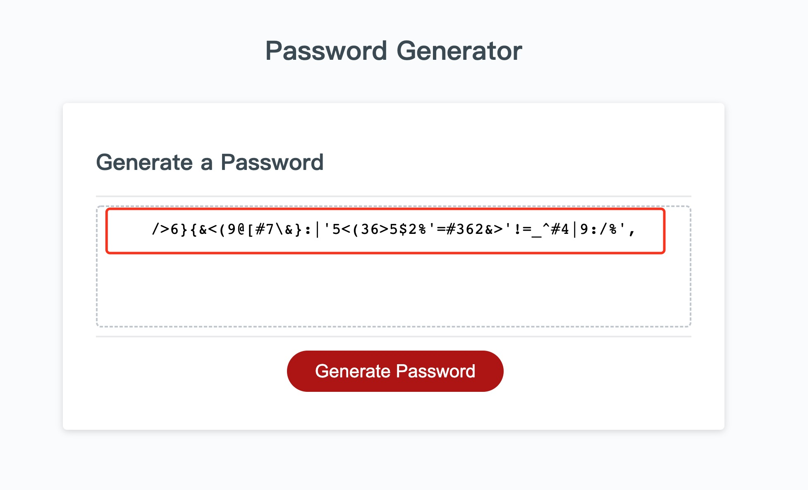   

## Deployment URL
https://dorisliu333.github.io/password_generator_chujunliu/
```